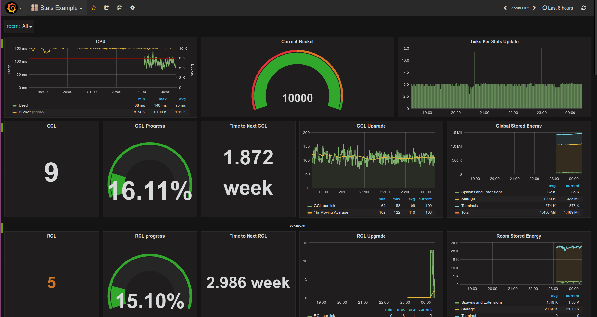

# screeps-grafana

Pretty graphs for Screeps stats. 


There are two ways to get started:

## Path 1: Easy but not robust
You can run this project locally, with all the drawbacks that entails.

Install [docker](https://docs.docker.com/engine/installation/)

Install [docker-compose](https://docs.docker.com/compose/install/)

Copy and edit the example config file:

```
cp docker-compose.env.example docker-compose.env
$EDITOR docker-compose.env
```

Note: If you are using Docker Toolbox you will also need to expose the port 1337 via the virtualbox port forwarding feature.

Run the setup:

```
bash setup.sh
```

Go to http://localhost:1337 in your browser, then see Usage below.

## Path 2: Robust but not easy

Acquire a server, I use a t2.micro from Amazon Web Services. You can use anything running ubuntu with passwordless sudo.

Open ports 80 and 81 in your security groups.

***SUPER IMPORTANT: MAKE SURE TO MOUNT A DATA VOLUME TO /dev/sdf IN THE AWS CONSOLE. IF YOU FAIL TO DO SO, YOUR DATA AND DASHBOARDS WILL BE LOST IF THE SERVER RESTARTS, THEN YOU WILL BE HELLA SALTY, AND I'LL JUST CROSS MY ARMS AND SAY "I TOLD YOU SO IN BOLDED ITALICS"***

Install [ansible](http://docs.ansible.com/ansible/intro_installation.html).

Create a password for your screeps account if you haven't already.

You're now ready to run this whale of a command. Replace the stuff in caps with values that makes sense

```
ansible-playbook \
  -e screeps_username=YOURUSERNAME \
  -e screeps_password=YOURPASSWORD \
  -e screeps_email=YOUREMAIL \
  --user ubuntu \
  --private-key YOURPRIVATEKEY \
  -i ,YOURSERVERIP \
  playbook.yml
```

**Don't remove the comma before `YOURSERVERIP`. You will get a mysterious error. If you pass your IP like `,12.34.56.78` you are doing it correctly.**

If the run errors out, check your parameters and retry. It is common to see transient errors from Apt or GPG, which are both fixed by re-running.

You are now ready to use grafana!

## Usage

Go to http://localhost:1337 or your own real-life server's IP. Login with the following default credentials:
NOTE: On Windows running Docker Toolbox use http://192.168.99.100:1337 instead

```
username: admin
password: admin
```
You are now ready to [create some dashboards](https://www.youtube.com/watch?v=OUvJamHeMpw).

To use the Sample Dashboard, copy the contents of [stats.js](stats.js)
A sample dashboard is already installed that displays the stats from [stats.js](stats.js)


To send stats to the dashboard, simply write them to `Memory.stats`. For example:

```
Memory.stats["room." + room.name + ".energyAvailable"] = room.energyAvailable;
Memory.stats["room." + room.name + ".energyCapacityAvailable"] = room.energyCapacityAvailable;
Memory.stats["room." + room.name + ".controllerProgress"] = room.controller.progress;
```
All values on the `Memory.stats` object are forwarded to Grafana verbatim.

## Adding Grafana plugins
Just run 
`docker-compose exec grafana grafana-cli plugins install grafana-clock-panel`
to install the plugins, then 
`docker-compose restart grafana`
to apply. Refresh your browser and voila!

## License

This software is licensed under the **MIT License**. See the [LICENSE](LICENSE) file for more information.
